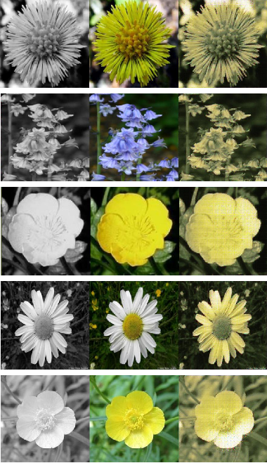
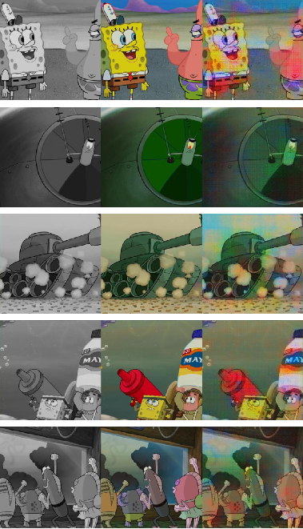

# Image Colorization using GANs

## Introduction
This repository is the implementation of Conditional GANs, to convert images from greyscale to RGB. It was done as part of Bachelor's Thesis project titled **Recolorisation of Images using Deep Neural Networks** by Athmay Nambiar and Bhavitvya Malik, in the department of Instrumentation and Control Engineering, Netaji Subhas Institute of Technology, University of Delhi, New Delhi, in partial fulfilment of requirements for the award of the degree of Bachelor of Engineering in Instrumentation and Control Engineering, University of Delhi in the academic year 2018-2019.

The input of the network is 1-channel greyscale image (specifically, the 'L' channel of LAB color space), and the Generator will create a 3-channel colorful version of the input image.

The generator has an encoder-decoder architecture; the discriminator is just one encoder plus fully-connected layers which gives one-class output. Skip-connection is applied in generator (U-Net). For 224x224 images, the architecture of generator is shown below.

Each block contains Conv(transpose Conv) layer, BatchNormalization and Leaky ReLU. Final activation function for generator is tanh; for discriminator its sigmoid. Input images are normalized before feeding into the network.

Overall, the objective function for Conditional GAN is:

for generator, a regularization term is added using L1 distance:

where the coefficient lambda 100 is used. The model is optimized using Adam optimizer with minor changes.

The model is universal for all kinds of colorful image dataset. Three datasets are experimented here: OxFlower, and SpongeBob

* [OxFlower](http://www.robots.ox.ac.uk/~vgg/data/flowers/17/): Flower dataset generated by Oxford VGG group. It consists of 17 flower categories with 80 images for each class.

* [SpongeBob SquarePants](https://en.wikipedia.org/wiki/SpongeBob_SquarePants): The famous American animated TV series. Images from one episode are extracted and processed.

## Instruction

### Prepare Dataset

#### OxFlower
Download the dataset from [VGG webpage](http://www.robots.ox.ac.uk/~vgg/data/flowers/17/). Make sure `jpg/` and `datasplits.mat` are in the same directory.

#### SpongeBob SquarePants
Download from [Google Drive](https://drive.google.com/file/d/1yaSHnqFiGT2VwT373lY_E3AJpr6r9b4l/view?usp=sharing).

### Training (and validation)

* Example command to train Spongebob dataset:

`python gan_main.py my_path --dataset bob --batch_size 32 --lr 1e-3 --num_epoch 50 --lamb 100 -s --gpu 0`

Replace `my_path` by the root path of Spongebob dataset.

Image samples created during validation will be saved in `img/`; and the model will be saved in `model/` if `-s` option is used.

## Results

Due to paucity of computation, we could only train upto 100 epochs. Below are the attached outputs for Flowers and Spongebob datasets (each set contains 3 images Left- Input image in greyscale, Middle- Original image, Right- Output image):

OxFlower Dataset
<figure>
    

        
        
        
    

    <figcaption align = "center"><b>Left- Results at 0 epoch, Middle- Results at 50 epochs, Right- Results at 100 epochs</b></figcaption>
</figure>
<!-- 
Left- Results at 0 epoch, Middle- Results at 50 epochs, Right- Results at 100 epochs
 -->

SpongeBob Dataset

    
    
    

Left- Results at 0 epoch, Middle- Results at 50 epochs, Right- Results at 100 epochs

<!-- 

<!-- 

 -->
